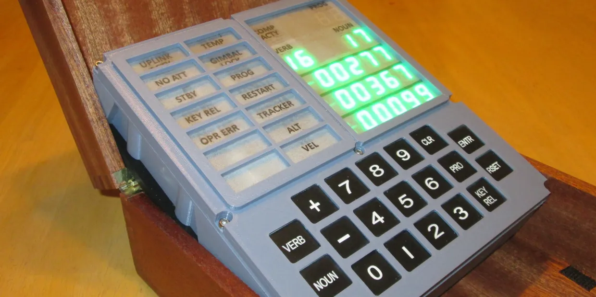

#Building an Apollo DSKY mock device

The **Apollo Guidance Computer (AGC)** **Display and Keyboard (DKSY)** mock device will only simulate a few key scenarios from Apollo 11 and Apollo 13. The hardware will comprise a 3D printed shell with a built in ESP32 driving the keypad and LEDs. It will be powered by a rechargable LiPo battery. 

Using the [Open DSKY](https://opendsky.com) project as a reference for creating my own. That project has the following [Instructables](https://www.instructables.com/Open-Apollo-Guidance-Computer-DSKY/) page. 

MAX7219

58mm Height

12.7mm x 19 mm x 8 mm
