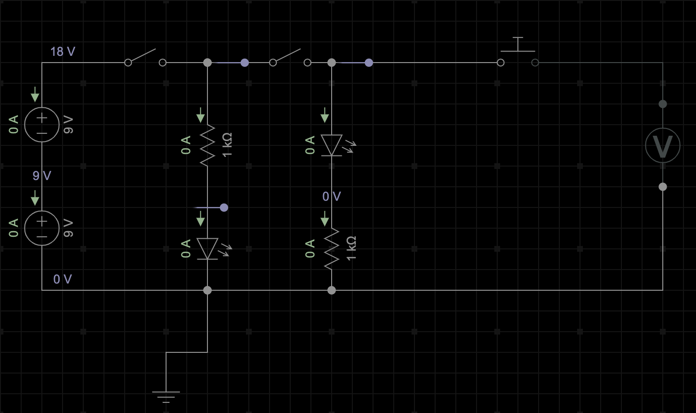

# Model Rocket Launch Controller

Progress
<progress id="file" value="5" max="100"> 5% </progress>

My Estes model rocket launch controller is no longer functioning. Time to build my own. 

The following circuit provides three switches:
- Power - switches the power on.
- Arm - Readies the circuit for launch.
- Launch - ignites the starter. 

I set up a simple circuit with one push button to test igniting the starter with a single 9V battery.

<iframe width="560" height="315" src="https://www.youtube.com/embed/e_dRcx35d10" title="YouTube video player" frameborder="0" allow="accelerometer; autoplay; clipboard-write; encrypted-media; gyroscope; picture-in-picture" allowfullscreen></iframe>
