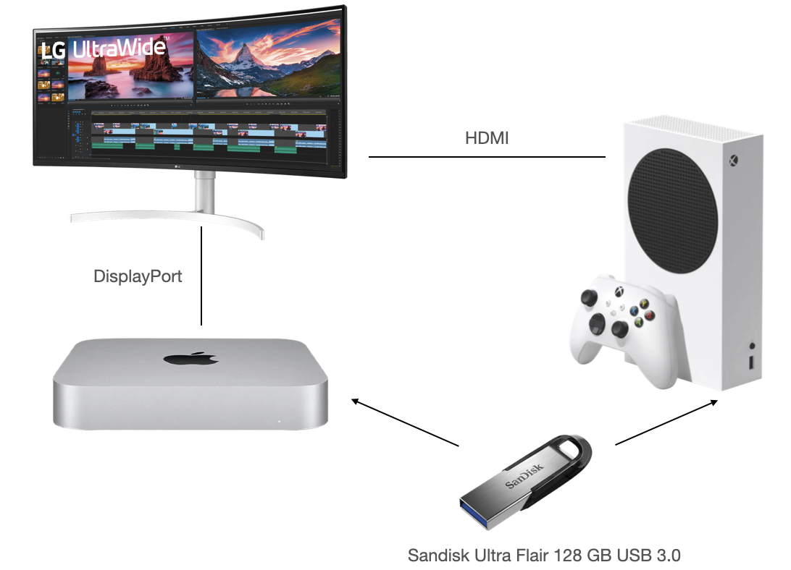

#Xbox Series S Setup

The Xbox Series S is a relatively low cost entry into the Microsoft gaming world for Mac users. There were three games in particular that nudged me over the line to buy an Xbox: 

- Halo
- Gears 5
- MS Flight Simulator

Since the Xbox is connected to my monitor (LG 38WN95C-W) it has the additional benefit of rendering Fortnite at 120 fps given the monitor supports 144 Hz. 

Recoring gameplay on the Xbox is limited compared to the PS5. To allow for long record times an external drive must be connected however the drive must be formatted in NTFS. This is a challenge with a Mac only household. 

I installed [Paragon Software's MS NTFS for Mac](https://www.paragon-software.com/home/ntfs-mac/) and formatted a Sandisk Extreme SSD (1 TB) with NFTS. Unfortunately the Xbox did not recognise the drive. I formatted the drive as exFAT and it did recognise it. I installed Parallels 17 and Windows 10 ARM edition, formatted the drive within Windows as NTFS and that was recongised by the Xbox. 

Installing Paragon's MS NTFS sofware does require you to enable kernal extensions by booting into Recovery Mode to enable it. This doesn't feel safe so i'll stick with Parallels and Windows to continue copying gameplay footage from the external drive. 

I've also switched to using the Sandisk Ultra Flair USB 3.0 128 GB thumb drive. This has plenty of storage and sufficient speed for recording gameplay on the Xbox. It is a simple matter of unplugging from the Xbox and plugging into the Mac, launching Parallels/Windows (on Mac Mini M1 it launches within 10 seconds) and copying to the local drive. 

