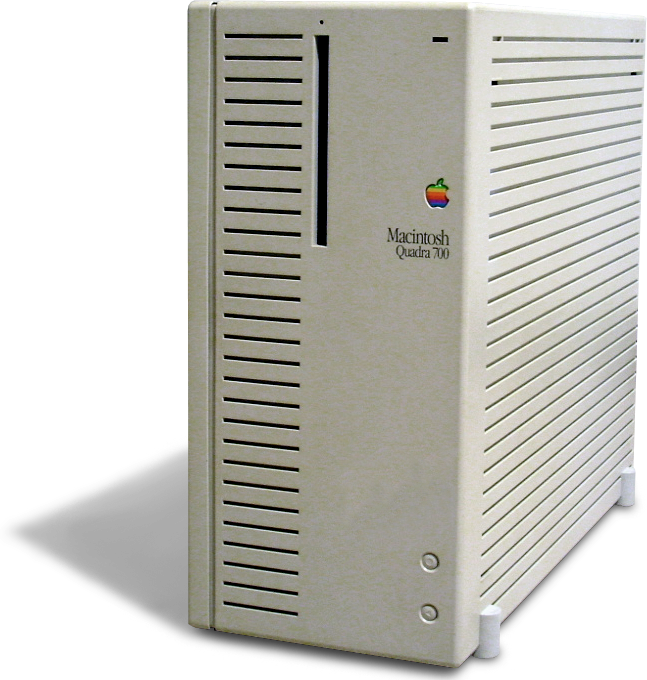

# Apple Macintosh Quadra 700

Also known as the computer from the Jurassic Park movie the Macintosh Quadra 700 comprises a 32-bit 68040 CPU running at 25 MHz. I found one on eBay with the following specifications:

20 MB RAM
250 MB HDD
1.44 Floppy

The assembled setup includes the following components:

- Apple keyboard
- Apple mouse
- AAUI adapter
- D15 Male to Male monitor cable
- Apple Macintosh AppleColor 13" High Resolution RGB Display Monitor (M0401z
)

