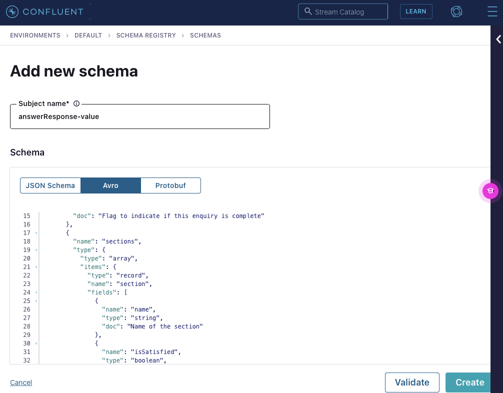

# KSQL and Schema Registry

The following AVRO value schema represents a complex nested structure. The top level is a record that comprises a set of basic data type based fields such as enquiryId and isSatisfied. The *sections* field is an array of a complex record that in turn comprises a set of basic data type fields and another nested array of other records. 

```JSON
{
  "type": "record",
  "namespace": "com.fidelitylife.digital",
  "name": "updateEnquirySendAnswerResponseValue",
  "doc": "Schema for the response message received from UnderwriteMe",
  "fields": [
    {
      "name": "branch",
      "type": "string",
      "doc": "The brand of the rulebook (eg Westpac, Fidelity)"
    },
    {
      "name": "tag",
      "type": "string",
      "doc": "The version of the rulebook (eg v1, v2)"
    },
    {
      "name": "isSatisfied",
      "type": "boolean",
      "doc": "Flag to indicate if this enquiry is complete"
    },
    {
      "name": "isOpen",
      "type": "boolean",
      "doc": "Flag to indicate if this enquiry is open"
    },
    {
      "name": "sections",
      "type": {
        "type": "array",
        "items": {
          "type": "record",
          "name": "section",
          "fields": [
            {
              "name": "name",
              "type": "string",
              "doc": "Name of the section"
            },
            {
              "name": "isSatisfied",
              "type": "boolean",
              "doc": "Flag to indicate if this section is complete"
            },
            {
              "name": "enquiryLines",
              "type": {
                "type": "array",
                "items": {
                  "type": "record",
                  "name": "enquiryLine",
                  "fields": [
                    {
                      "name": "name",
                      "type": "string",
                      "doc": "The name of the enquiry line"
                    },
                    {
                      "name": "isSatisfied",
                      "type": "boolean",
                      "doc": "Flag to indicate if the enquiry line is complete"
                    },
                    {
                      "name": "questions",
                      "type": {
                        "type": "array",
                        "items": {
                          "type": "record",
                          "name": "question",
                          "fields": [
                            {
                              "name": "name",
                              "type": "string",
                              "doc": "Name of the question"
                            },
                            {
                              "name": "isSatisfied",
                              "type": "boolean",
                              "doc": "A flag to indicate whether the question is satisified (has a valid answer)."
                            },
                            {
                              "name": "hasAnswer",
                              "type": "boolean",
                              "doc": "A flag to indicate whether the question has an answer or not."
                            },
                            {
                              "name": "answers",
                              "type": {
                                "type": "array",
                                "items": {
                                  "type": "string"
                                }
                              }
                            }
                          ]
                        }
                      }
                    }
                  ]
                }
              }
            }
          ]
        }
      }
    },
    {
      "name": "buckets",
      "type": [
        "null",
        {
          "type": "array",
          "items": {
            "type": "record",
            "name": "bucket",
            "fields": [
              {
                "name": "type",
                "type": {
                  "name": "type",
                  "type": "enum",
                  "symbols": [
                    "NUMBER",
                    "OPTION",
                    "DATE"
                  ]
                },
                "doc": "There are three types of buckets: NUMBER, OPTION and DATE. Number buckets can only accept numbers, option buckets can only accept values from a defined list."
              },
              {
                "name": "name",
                "type": "string",
                "doc": "The name of the bucket."
              },
              {
                "name": "min",
                "doc": "The minimum contribution made to a bucket.",
                "type": {
                  "type": "record",
                  "name": "min",
                  "fields": [
                    {
                      "name": "value",
                      "type": [
                        "string",
                        "int"
                      ]
                    }
                  ]
                }
              },
              {
                "name": "max",
                "doc": "The maximum contribution made to a bucket.",
                "type": {
                  "type": "record",
                  "name": "max",
                  "fields": [
                    {
                      "name": "value",
                      "type": [
                        "string",
                        "int"
                      ]
                    }
                  ]
                }
              }
            ]
          }
        }
      ],
      "default": null
    }
  ]
}
```

The following is the associated key schema in AVRO format:

```json
{
  "type": "record",
  "namespace": "com.fidelitylife.digital",
  "name": "updateEnquirySendAnswerResponseKey",
  "doc": "Schema for the response message key received from UnderwriteMe",
  "fields": [
    {
      "name": "enquiryId",
      "type": "string",
      "doc": "The unique identifier for the enquiry"
    }
  ]
}

```

## Adding AVRO schemas to Confluent Cloud Schema Registry

Use the UI to add the schemas. Ensure you add "-value" and "-key" to the end of the schema names. 




To create a stream that leverages the schemas that were previously registered.

```SQL
create stream updateEnquirySendAnswerResponseStream (enquiryID VARCHAR KEY) WITH (KAFKA_TOPIC = 'updateEnquirySendAnswerResponse', KEY_FORMAT = 'AVRO', VALUE_FORMAT = 'AVRO', PARTITIONS = 6);
```

KSQL will match the topic name to the schema by automatically adding "-value" and "-key" which is why we added "-value" and "-key" in the schema registry step earlier. 

Show the stream that was created:

```BASH

ksql> list streams;

 Stream Name                           | Kafka Topic                     | Key Format | Value Format | Windowed 
----------------------------------------------------------------------------------------------------------------
 KSQL_PROCESSING_LOG                   | pksqlc-w19ww-processing-log     | KAFKA      | JSON         | false    
 UPDATEENQUIRYSENDANSWERRESPONSESTREAM | updateEnquirySendAnswerResponse | AVRO       | AVRO         | false    
----------------------------------------------------------------------------------------------------------------
ksql> 

```

Show the topics created:


```bash
ksql> show topics;

 Kafka Topic                        | Partitions | Partition Replicas 
----------------------------------------------------------------------
 customers                          | 6          | 3                  
 employees                          | 6          | 3                  
 pksqlc-vn80j-processing-log        | 8          | 3                  
 pksqlc-vn80jCURRENTLOCATION        | 1          | 3                  
 pksqlc-vn80jLATEST_CUSTOMERS       | 6          | 3                  
 pksqlc-vn80jRIDERSNEARMOUNTAINVIEW | 1          | 3                  
 pksqlc-w19ww-processing-log        | 8          | 3                  
 quickstart-locations               | 1          | 3                  
 updateEnquirySendAnswerResponse    | 6          | 3                  
 users                              | 1          | 3                  
----------------------------------------------------------------------
```

Describing the stream:


```bash
ksql> describe updateEnquirySendAnswerResponseStream;

Name                 : UPDATEENQUIRYSENDANSWERRESPONSESTREAM
 Field       | Type                                                                                                                                                                                                                                                   
----------------------------------------------------------------------------------------------------------------------------------------------------------------------------------------------------------------------------------------------------------------------
 ENQUIRYID   | VARCHAR(STRING)  (key)                                                                                                                                                                                                                                 
 BRANCH      | VARCHAR(STRING)                                                                                                                                                                                                                                        
 TAG         | VARCHAR(STRING)                                                                                                                                                                                                                                        
 ISSATISFIED | BOOLEAN                                                                                                                                                                                                                                                
 ISOPEN      | BOOLEAN                                                                                                                                                                                                                                                
 SECTIONS    | ARRAY<STRUCT<NAME VARCHAR(STRING), ISSATISFIED BOOLEAN, ENQUIRYLINES ARRAY<STRUCT<NAME VARCHAR(STRING), ISSATISFIED BOOLEAN, QUESTIONS ARRAY<STRUCT<NAME VARCHAR(STRING), ISSATISFIED BOOLEAN, HASANSWER BOOLEAN, ANSWERS ARRAY<VARCHAR(STRING)>>>>>>> 
 BUCKETS     | ARRAY<STRUCT<TYPE VARCHAR(STRING), NAME VARCHAR(STRING), MIN STRUCT<VALUE STRUCT<STRING VARCHAR(STRING), INT INTEGER>>, MAX STRUCT<VALUE STRUCT<STRING VARCHAR(STRING), INT INTEGER>>>>                                                                
----------------------------------------------------------------------------------------------------------------------------------------------------------------------------------------------------------------------------------------------------------------------
For runtime statistics and query details run: DESCRIBE <Stream,Table> EXTENDED;

```

You can see the schema representation under the sections field as a nested structure (with STRUCT).

To test the publishing of a message in AVRO and receiving it in AVRO:

Start the client to receive the messages:

```bash
confluent kafka topic consume updateEnquirySendAnswerResponse --value-format avro --print-key --delimiter ":" --sr-endpoint "https://psrc-5mn3g.ap-southeast-2.aws.confluent.cloud" --sr-api-key NPUSPNJQWEGJVEPZ --sr-api-secret kkptVNihVsmmwBj8qRiOiMdWkFq+fvRUapKS+0A0GH16/FJxOZMjNex8XSB/qq0P
```

and publish using HTTP API:

```JSON
POST /topics/updateEnquirySendAnswerResponse HTTP/1.1
Host: localhost:8082
Content-Type: application/vnd.kafka.avro.v2+json
Accept: application/vnd.kafka.v2+json
Content-Length: 517

{
    "key_schema_id":100016,
    "value_schema_id": 100017,
    "records": [
        {
            "key":{"enquiryId":"1000-1000-1000-1000"},
            "value": {"branch":"Westpac_Digital","tag":"v1","isSatisfied":true,"isOpen":true,"sections":[{"name":"Advice","isSatisfied":true,"enquiryLines":[{"name":"LIFEINSURED_BASIC_DETAILS","isSatisfied":true,"questions":[{"name":"LIFEINSURED_AGE","isSatisfied":true,"hasAnswer":true,"NewKey":["37"]},{"name":"LIFEINSURED_HEIGHT","isSatisfied":true,"hasAnswer":true,"NewKey":["186"]}]}]}],"buckets":[{"type":"OPTION","name":"DECISION_LIFE","min":{"value":"STANDARD"}},{"type":"OPTION","name":"TRAUMA","min":{"value":"STANDARD"}},{"type":"OPTION","name":"INCOME_PROTECTION","min":{"value":"STANDARD"}}]}
        }
    ]
}
```

Note that when the topic was created using the following:


```SQL
create stream updateEnquirySendAnswerResponseStream (enquiryID STRING KEY) WITH (KAFKA_TOPIC = 'updateEnquirySendAnswerResponse', KEY_FORMAT = 'AVRO', VALUE_FORMAT = 'AVRO', PARTITIONS = 6);
```

Where the KEY_FORMAT is KAFKA it means the key is standard KAFKA format such as INT, BIGINT, DOUBLE and STRING. However, with this stream the key format is AVRO.

## Evolving the schemas

If the AVRO schemas evolve they can be updated in the Schema Registry. The Schema Registry compatibility must be set appropriately for the topic dependning on the desired changes. 

The scheme is updated as follows:

```json
{
  "type": "record",
  "namespace": "com.fidelitylife.digital",
  "name": "updateEnquirysendAnswerResponseValue",
  "doc": "Schema for the response message received from UnderwriteMe",
  "fields": [
    {
      "name": "enquiryId",
      "type": "string",
      "doc": "The unique identifier for the enquiry"
    },
    {
      "name": "branch",
      "type": "string",
      "doc": "The brand of the rulebook (eg Westpac, Fidelity)"
    },
    {
      "name": "tag",
      "type": "string",
      "doc": "The version of the rulebook (eg v1, v2)"
    },
    {
      "name": "isSatisfied",
      "type": "boolean",
      "doc": "Flag to indicate if this enquiry is complete"
    },
    {
      "name": "isOpen",
      "type": "boolean",
      "doc": "Flag to indicate if this enquiry is open"
    },
    {
      "name": "sections",
      "type": {
        "type": "array",
        "items": {
          "type": "record",
          "name": "section",
          "fields": [
            {
              "name": "name",
              "type": "string",
              "doc": "Name of the section"
            },
            {
              "name": "isSatisfied",
              "type": "boolean",
              "doc": "Flag to indicate if this section is complete"
            },
            {
              "name": "enquiryLines",
              "type": {
                "type": "array",
                "items": {
                  "type": "record",
                  "name": "enquiryLine",
                  "fields": [
                    {
                      "name": "name",
                      "type": "string",
                      "doc": "The name of the enquiry line"
                    },
                    {
                      "name": "isSatisfied",
                      "type": "boolean",
                      "doc": "Flag to indicate if the enquiry line is complete"
                    },
                    {
                      "name": "questions",
                      "type": {
                        "type": "array",
                        "items": {
                          "type": "record",
                          "name": "question",
                          "fields": [
                            {
                              "name": "name",
                              "type": "string",
                              "doc": "Name of the question"
                            },
                            {
                              "name": "isSatisfied",
                              "type": "boolean",
                              "doc": "Flag to indicate if the question has been answered"
                            }
                          ]
                        }
                      }
                    }
                  ]
                }
              }
            }
          ]
        }
      }
    },
    {
      "name": "buckets",
      "type": [
        "null",
        {
          "type": "array",
          "items": {
            "type": "record",
            "name": "bucket",
            "fields": [
              {
                "name": "type",
                "type": {
                  "name": "type",
                  "type": "enum",
                  "symbols": [
                    "NUMBER",
                    "OPTION",
                    "DATE"
                  ]
                },
                "doc": "There are three types of buckets: NUMBER, OPTION and DATE. Number buckets can only accept numbers, option buckets can only accept values from a defined list."
              },
              {
                "name": "name",
                "type": "string",
                "doc": "The name of the bucket."
              },
              {
                "name": "min",
                "doc": "The minimum contribution made to a bucket.",
                "type": {
                  "type": "record",
                  "name": "min",
                  "fields": [
                    {
                      "name": "value",
                      "type": [
                        "string",
                        "int"
                      ]
                    }
                  ]
                }
              },
              {
                "name": "max",
                "doc": "The maximum contribution made to a bucket.",
                "type": {
                  "type": "record",
                  "name": "max",
                  "fields": [
                    {
                      "name": "value",
                      "type": [
                        "string",
                        "int"
                      ]
                    }
                  ]
                }
              }
            ]
          }
        }
      ],
      "default": null
    }
  ]
}
```

We are simply adding a field to the schema that is an array of nested structures (Buckets).

Click the "Evolve Schema" button in the schema registry for that schema. 

Paste in the updated schema and validate it. Assuming it passes save the schema. 

The schema ID will be changed. The default compatibility mode is "Backward". This allows for consumers using the new schema to be able to read data produced using the previous schema (x-1). 

When you apply the new schema it updates the topic but not the stream. The stream is backed by the topic but doesn't automatically receive the necessary updates from the schema changes. 

You can see the result by trying to create a stream from the stream using the newly added field:

```sql

ksql> select enquiryinteractionid, enquiryid, branch, issatisfied, buckets[0]->name, buckets[0]->min->value from UPDATEENQUIRYSENDANSWERRESPONSESTREAM EMIT CHANGES;

Line: 1, Col: 62: SELECT column 'BUCKETS' cannot be resolved.
Statement: select enquiryinteractionid, enquiryid, branch, issatisfied, buckets[0]->name, buckets[0]->min->value from UPDATEENQUIRYSENDANSWERRESPONSESTREAM EMIT CHANGES;

```

In order to do that you  must issue a 'create or replace' request. 

```sql

create or replace stream updateEnquirySendAnswerResponseStream (enquiryInteractionId VARCHAR KEY) WITH (KAFKA_TOPIC = 'updateEnquirySendAnswerResponse', KEY_FORMAT = 'KAFKA', VALUE_FORMAT = 'AVRO', PARTITIONS=6);

Message        
----------------
 Stream created 

```

Note that we added the new field at the end of the existing schema structure. If we had inserted it between the second last field and the last field, we would have changed the order and that is not allowed. See the error message here:

```sql
ksql> create or replace stream updateEnquirySendAnswerResponseStream (enquiryInteractionId VARCHAR KEY) WITH (KAFKA_TOPIC = 'updateEnquirySendAnswerResponse', KEY_FORMAT = 'KAFKA', VALUE_FORMAT = 'AVRO', PARTITIONS=6);

Cannot upgrade data source: DataSource '`UPDATEENQUIRYSENDANSWERRESPONSESTREAM`' has schema = `ENQUIRYINTERACTIONID` STRING KEY, `ENQUIRYID` STRING, `BRANCH` STRING, `TAG` STRING, `ISSATISFIED` BOOLEAN, `ISOPEN` BOOLEAN, `SECTIONS` ARRAY<STRUCT<`NAME` STRING, `ISSATISFIED` BOOLEAN, `ENQUIRYLINES` ARRAY<STRUCT<`NAME` STRING, `ISSATISFIED` BOOLEAN, `QUESTIONS` ARRAY<STRUCT<`NAME` STRING, `ISSATISFIED` BOOLEAN>>>>>> 

which is not upgradeable to 

`ENQUIRYINTERACTIONID` STRING KEY, `ENQUIRYID` STRING, `BRANCH` STRING, `TAG` STRING, `ISSATISFIED` BOOLEAN, `ISOPEN` BOOLEAN, `BUCKETS` ARRAY<STRUCT<`TYPE` STRING, `NAME` STRING, `MIN` STRUCT<`VALUE` STRUCT<`STRING` STRING, `INT` INTEGER>>, `MAX` STRUCT<`VALUE` STRUCT<`STRING` STRING, `INT` INTEGER>>>>, `SECTIONS` ARRAY<STRUCT<`NAME` STRING, `ISSATISFIED` BOOLEAN, `ENQUIRYLINES` ARRAY<STRUCT<`NAME` STRING, `ISSATISFIED` BOOLEAN, `QUESTIONS` ARRAY<STRUCT<`NAME` STRING, `ISSATISFIED` BOOLEAN>>>>>>. 

(The following columns are changed, missing or reordered: [`SECTIONS` ARRAY<STRUCT<`NAME` STRING, `ISSATISFIED` BOOLEAN, `ENQUIRYLINES` ARRAY<STRUCT<`NAME` STRING, `ISSATISFIED` BOOLEAN, `QUESTIONS` ARRAY<STRUCT<`NAME` STRING, `ISSATISFIED` BOOLEAN>>>>>>])

```
